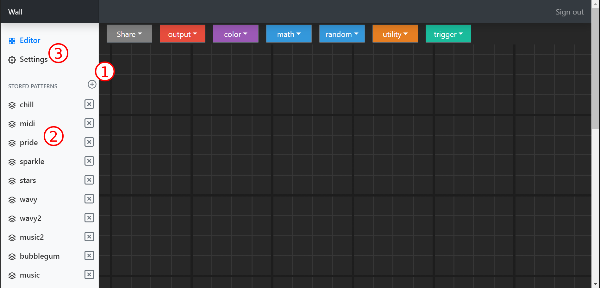
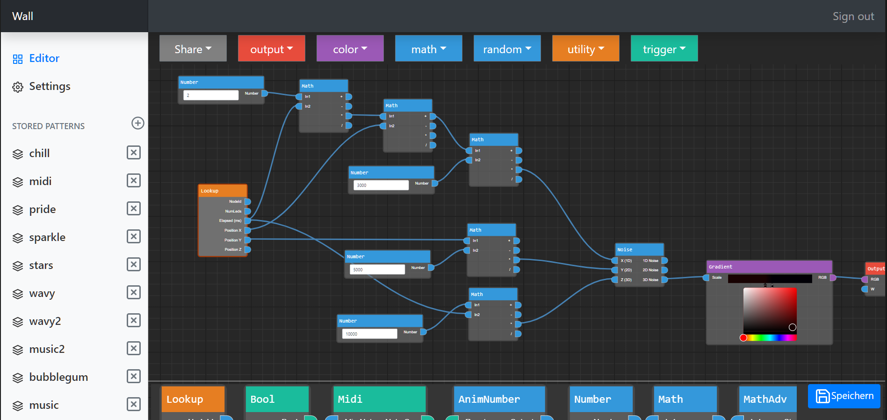
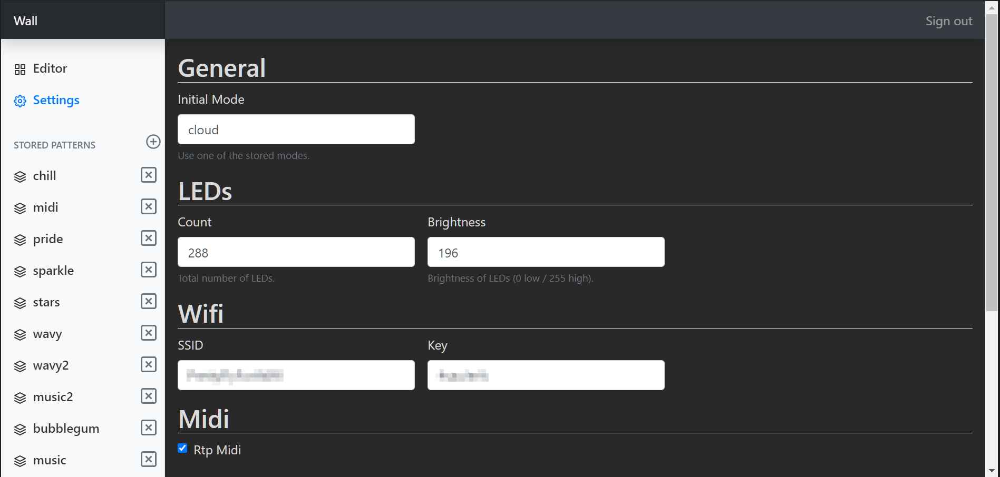

# Leuchtknoten-ui

React Frontend of [Leuchtknoten](https://github.com/JustusUlbrich/Leuchtknoten).

It features an interactive node editor, which is used to create patterns for the LED controller running on the esp32.

The goal was to make the frontend small enough to fit on the esp32 flash, so it can be served directly from there.

## Usage

**Please note that currently the url / IP address of the led controller is hard coded as `REACT_APP_BASE_URL` in `/.env`. Before using the frontend you have to adjust this according to local setup.**

After running the frontend locally or accessing the frontend from the LED controller you can:

1. Create a new pattern
2. Open/edit existing pattern
3. Change led controller settings

### Edit

### Settings

## Development

Use `yarn install` to install all dependencies and `yarn start` to run the frontend locally.

After making changes you need to run `yarn build`. It will merge all styles and javascript into a single static `.html` so it can't easily be served from the esp. Just copy `/public/index.html` to your data folder of [Leuchtknoten](https://github.com/JustusUlbrich/Leuchtknoten) and rebuild / reupload the file system.

## Contributing
Pull requests are welcome. For major changes, please open an issue first to discuss what you would like to change.

## License
[MIT](./LICENSE)